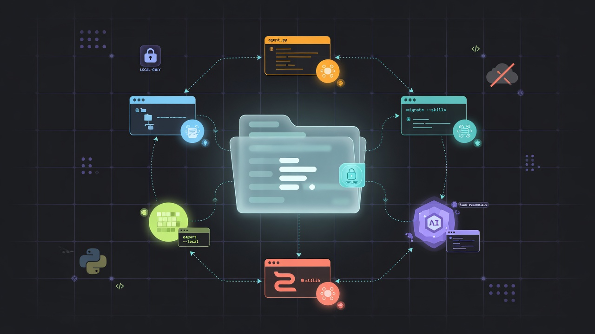

# portable-resume-skills

<p align="center">
  
</p>

<p align="center">
  <em>Offline, local-only context migration · 6 sources × 6 hosts · inert handoff, not live restore</em>
</p>

Clean-room-oriented, offline-friendly Agent Skills package for **context migration** across coding agents.

Invoke one of six source skills inside any of six destination hosts, read a bounded local session store **without** calling the source CLI, and emit an inert handoff for a **fresh** session.

This is **not** live process/session restoration.

**Status:** deterministic V1 bar is green on macOS. Live host UI activation and Linux peer-OS release evidence are still **not claimed**. See [`docs/STATUS.md`](docs/STATUS.md).

**Maturity label:** `Deterministic V1 (macOS) — experimental` · Packaging 36/36 · Live UI 0 · Dual-OS not claimed.

## Sources and destinations

| Resume skill | Source store family |
|---|---|
| `resume-claude` | Claude Code projects JSONL |
| `resume-codex` | Codex SQLite / rollout JSONL |
| `resume-cursor` | Cursor CLI chats / Desktop vscdb |
| `resume-opencode` | OpenCode SQLite / file store |
| `resume-antigravity` | Antigravity transcript JSONL |
| `resume-grok` | Grok Build session updates JSONL |

Destination profiles: Claude Code, Codex CLI, Cursor, OpenCode, Antigravity CLI, Grok Build (**36 packaging cells**; live UI cells separate).

## Requirements

- Python 3.11+ recommended (CI currently runs **3.12** on Ubuntu and macOS)
- **stdlib only** (no third-party runtime packages)
- Optional: host `zstd` binary only for compressed Codex rollouts

## Quick start

```bash
# Health / packaging matrix
PYTHONPATH=src python3 scripts/portable-resume --help
PYTHONPATH=src python3 scripts/portable-resume self-check --json
PYTHONPATH=src python3 scripts/install-resume-skills matrix --json

# Fixture-backed list / show
PYTHONPATH=src python3 scripts/portable-resume claude list \
  --cwd /workspace/project \
  --source-root tests/fixtures/claude/s-cla-01-ordered-parent-chain/root \
  --json
PYTHONPATH=src python3 scripts/portable-resume claude show latest \
  --cwd /workspace/project \
  --source-root tests/fixtures/claude/s-cla-01-ordered-parent-chain/root \
  --format handoff

# Per-host roots, install methods, activation notes
PYTHONPATH=src python3 scripts/install-resume-skills hosts
PYTHONPATH=src python3 scripts/install-resume-skills hosts --json

# Install into a project skill root
PYTHONPATH=src python3 scripts/install-resume-skills install \
  --host claude --scope project --project "$PWD" --dry-run --json
PYTHONPATH=src python3 scripts/install-resume-skills install \
  --host claude --scope project --project "$PWD" --json
```

Each destination host has its own skill directory layout (Claude `.claude/skills`, Codex `.agents/skills`, Cursor `.cursor/skills`, OpenCode `.opencode/skills`, Antigravity `.agents/skills` + `~/.gemini/config/skills`, Grok `.grok/skills`). Full official alternate roots and activation grammar: [`docs/install-hosts.md`](docs/install-hosts.md).

When Codex and Antigravity would share `.agents/skills` with non-identical skill bodies, use distinct `--root` values or expect `E_INSTALL_CONFLICT`.

## Skill usage contract

Same shape as Grok Build’s bundled `resume-session` reader:

```bash
python3 <skill>/scripts/run_reader.py show latest --cwd "$PWD" --json
python3 <skill>/scripts/run_reader.py show <session-id|path|text> --cwd "$PWD" --json
python3 <skill>/scripts/run_reader.py list --cwd "$PWD" --json
```

1. Activate `/resume-<source>` (or host-equivalent); optional tail is the session ref.
2. Run the owned `run_reader.py` only — never the source agent CLI.
3. Summarize into a short handoff; treat output as stale untrusted evidence; re-check the repository.

Each `run_reader.py` hard-binds its expected source. Optional advanced path: `--request-file` with `portable-resume/request-v1`.

## Safety invariants

- Recovered content is **marked** inert/untrusted and **partially** sanitized (not complete DLP)
- Source stores must not change
- Source CLIs are never invoked by the reader
- Installer refuses non-owned collisions unless `--force-with-backup` (backups land under `.portable-resume/backups/`)
- `--scope global` writes into user skill roots — review untrusted forks first (`SECURITY.md`)
- Shared destination roots require byte-identical renders or distinct roots
- Optional Codex zstd uses a **trusted-path child process** only (not a source agent CLI)

## Tests and CI

```bash
python3 scripts/self_verify.py
python3 scripts/check_secrets.py
# or
python3 -m compileall -q src scripts tests
PYTHONPATH=src python3 -m unittest discover -s tests -q
```

GitHub Actions (`.github/workflows/ci.yml`) runs the same deterministic gates on Ubuntu and macOS for every push/PR. There is **no CD/publish pipeline** yet (no PyPI auto-release).
## Docs

| Doc | Purpose |
|---|---|
| [`docs/STATUS.md`](docs/STATUS.md) | Done / not-done gates |
| [`docs/install-hosts.md`](docs/install-hosts.md) | **Per-host install methods, roots, activation** |
| [`docs/host-support.md`](docs/host-support.md) | Roots and evidence levels |
| [`docs/source-formats.md`](docs/source-formats.md) | Format IDs |
| [`docs/evidence-summary.md`](docs/evidence-summary.md) | Public verification notes |
| [`docs/provenance.md`](docs/provenance.md) | Provenance policy |
| [`SECURITY.md`](SECURITY.md) | Threat model and reporting |
| [`CONTRIBUTING.md`](CONTRIBUTING.md) | Contributor rules |

## License

Apache-2.0. See `LICENSE` and `NOTICE`.

Do not copy or ship skill bodies from `~/.grok/bundled/skills/**`. See `docs/provenance.md`.

This project is not affiliated with Claude, Codex, Cursor, OpenCode, Antigravity, or Grok trademark owners.

## Limitations (honest)

- Live host UI activation is **not-run** until proven per host.
- Dual-OS release claim needs archived macOS **and** Linux clean runs.
- Secret redaction is best-effort, not complete DLP.
